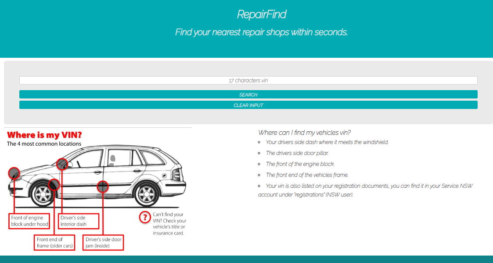
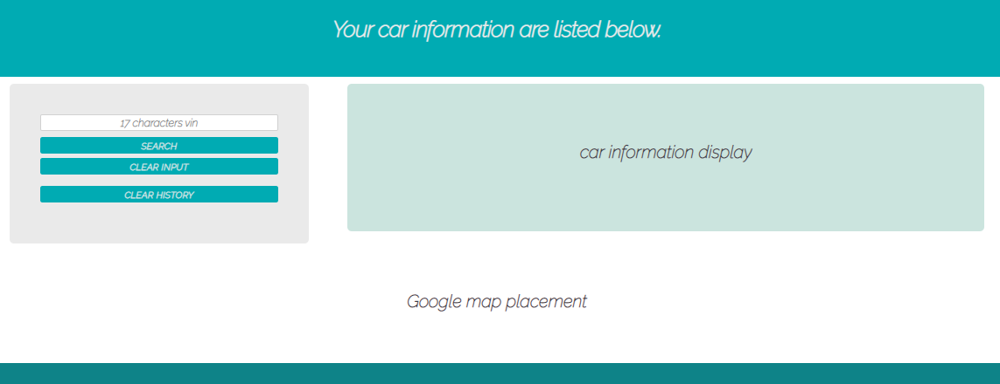

# RepairFind
## Get your vehicles information from your vin number, and find your nearest mechanic.

RepairFind is a live web application designed to help motorists streamline the process to find mechanical assistance.

## Table of Contents
- [User Story](#user-story)
- [Acceptance criteria](#acceptance-criteria)
- [Features](#features)
- [Technologies](#technologies)
- [Usage](#usage)
- [Development](#development)
- [Credits](#credits)
- [License](#license)

## User Story
As a car owner, I want to be able to provide my accurate car information to mechanics drawn from my VIN, and know what local mechanics are available to me, in any given area. 

## Acceptance Criteria
- WHEN I go to the homepage, there is a search bar that allows me to put in the Vehicle Identification Number (VIN) of my car.
- THEN I click the search button, it directs me to the landing page displaying the primary information of my car: make, model, and year.
- WHEN I click "clear input"
- THEN the input box is cleared of text
- WHEN I view the landing page
- THEN I am presented with my current location marked with a red pin labelled "A"
- THEN I see a green circle with a 5km radius
- THEN I see a orange circle with a 10km radius
- THEN I see my nearest car repair marked with a red pin
- WHEN I click on the car repair pin marks
- THEN I am presented with a window that displays the name of the business, the address, the phone number, and the customer rating
- WHEN I inspect the landing page further
- THEN I see my search history has been saved
- WHEN I inspect local storage
- THEN I see my search history has been saved locally
- WHEN I click a button to clear history
- THEN my local storage is cleared

## Features

- Populate your vehicles primary information by using your vin number. 
- Display your nearest mechanic in Google Maps.
- Save your search history locally for quick reference. 

## Technologies

RepairFind uses a number of technologies, including:

- HTML
- JavaScript
- CSS
- Skeleton CSS boilerplate
- Jquery
- Google Maps JavaScript API
- Places Library (for Maps JavaScript API)
- VIN Free Check, Instant VIN decorder API

More information and links to external technologies can be found in our "Credits" section. 

## Usage

On opening the RepairFind Homepage, users are presented with an input box, a search button, and simple directions on where they can find their vin number. 

Once the user inputs their vin number, they are redirected to the landing page. The user is presented with their vehicles make, model, and year, and (if the user has allowed location services) mechanics located within a variety or radii from their current location. 

If the user navigates directly to the landing page, they are presented with a search input box, and placeholders for each of the search results and Google Maps results. The user is able to use the search function from the landing page. 

From the landing page, users are able to view their search history, which is preserved using local storage. Users are able to clear their search history by clicking the "clear history" button. 

## Development

RepairFind was developed by Team 7, as a joint effort. Antonio Liu and Anna Art provided the JavaScript, API functionality, and local storage capabilities. Steven Dong and Briony Sherrell designed the website, ensured all technologies were incorporated into the HTML, and provided the READ.ME file. 

## Credits

Skeleton: A dead simple, responsive boilerplate. http://getskeleton.com/

Maps JavaScript API: https://developers.google.com/maps/documentation/javascript

Places Library for Maps JavaScript API: https://developers.google.com/maps/documentation/javascript/places

VIN Free Check, Instant VIN decorder API: https://www.vinfreecheck.com/vin-decoding-api

Rapid API: used to source VIN decoder API, https://rapidapi.com/vinfreecheck/api/vin-decoder-1/details

GIO Insurance, How do I find my vin? https://www.gio.com.au/faqs/car-insurance/how-do-i-find-my-vin.html

Parts Navigator: https://partsnavigator.com.au/

Dillinger.io: live markdown editor

https://dillinger.io/

day.js

## License

None Applicable

